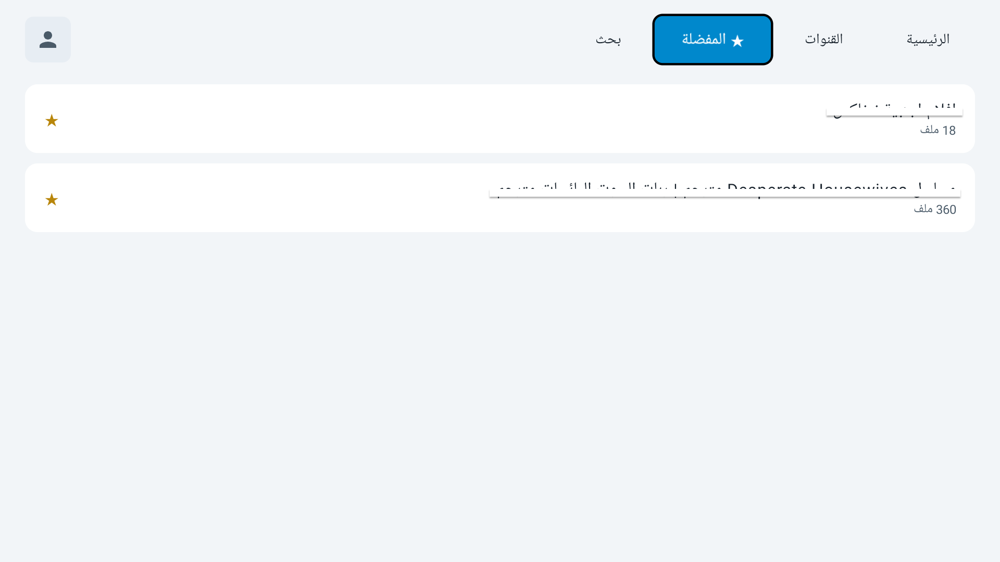
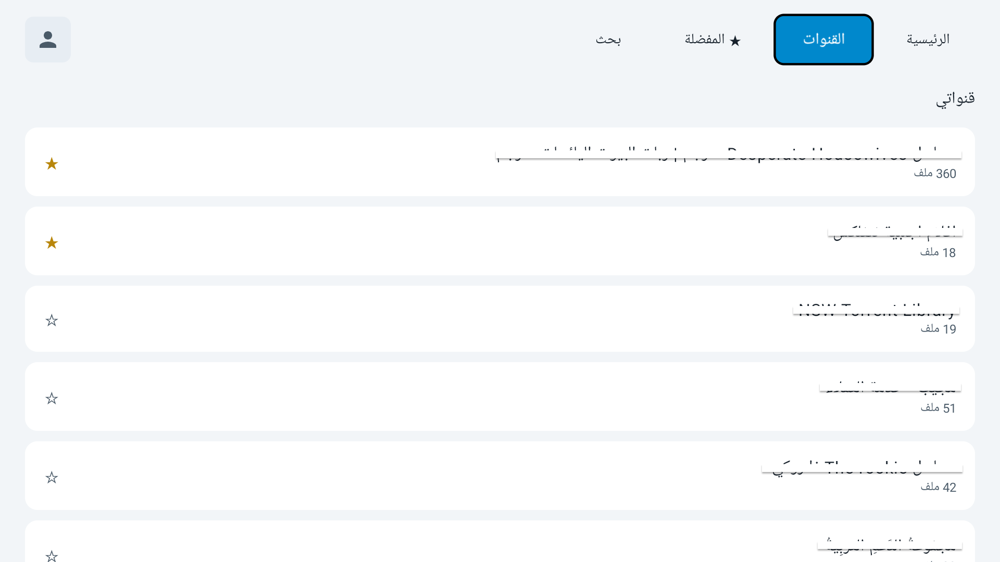
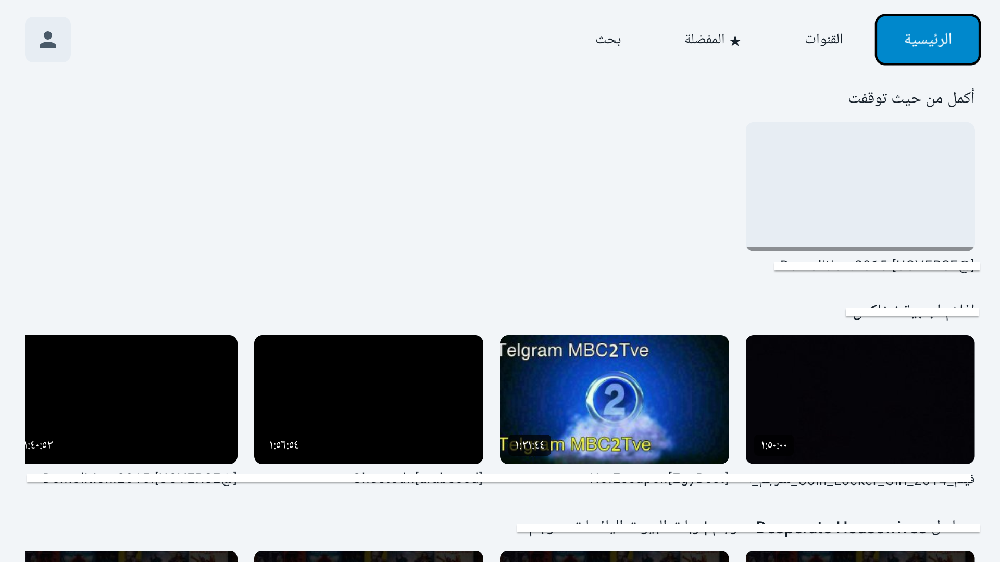

# TelegramTV

An Android TV app that displays your favorite Telegram channels' media in a clean viewing interface on your TV screen — with organized episodes, thumbnails, and auto-resume, and no middle server between you and Telegram.

**[App page & download ←](https://24hmood24.github.io/TeleGramTv/)**

---

## Features

- 📡 **Direct playback** — connects to your Telegram account via TDLib directly, no middle server involved
- 🗂️ **Clean grid interface** — your episodes organized with thumbnails and file duration, built for remote browsing
- ⭐ **Reorderable favorites** — pin your favorite channels and reorder them with a long-press and the remote
- ⏱️ **Auto-resume** — remembers where you stopped in every episode
- 👥 **Multiple accounts** — switch between multiple Telegram accounts on the same device
- 🔒 **PIN lock** — protect the app with a 4-digit PIN, unique to each account
- ⌨️ **Built-in remote keyboard** — Arabic/English on-screen keyboard built into the app itself
- 🔄 **In-app updates** — checks for newer versions and downloads/installs them automatically

| _(add a screenshot here)_ | _(add a screenshot here)_ | _(add a screenshot here)_ |
|---|---|---|

## Installation

1. Go to the [Releases](https://github.com/24hmood24/TeleGramTv/releases/latest) page
2. Download the latest `.apk` file
3. Install it on an Android TV device (you'll need to enable "Allow installs from unknown sources" the first time)
4. Sign in with the phone number linked to your Telegram account

### Requirements
- A device running Android TV (API 28 or higher)
- An active Telegram account

## Tech Stack

- **Kotlin** + **Jetpack Compose for TV** (androidx.tv.material3)
- **TDLib** (Telegram's official library) via [up9cloud/android-libtdjson](https://github.com/up9cloud/android-libtdjson)
- **Media3 / ExoPlayer** for video playback
- **NanoHTTPD** for local file streaming to the player

## Disclaimer

This is an **unofficial** app, not affiliated with Telegram. It only displays content already available in the user's own Telegram account, and does not host or distribute any content itself. Users are fully responsible for complying with Telegram's terms of service and any copyright related to the content they browse.

## License

For personal use. No commercial distribution license is currently available.

---
---

# TelegramTV

تطبيق أندرويد تلفزيون يعرض ملفات قنوات تيليجرام المفضلة عندك بواجهة مشاهدة أنيقة على شاشة التلفزيون — بترتيب حلقات، صور مصغرة، واستكمال تلقائي، بدون أي سيرفر وسيط بينك وبين تيليجرام.

**[صفحة التطبيق والتحميل ←](https://24hmood24.github.io/TeleGramTv/)**

---

## المزايا

- 📡 **تشغيل مباشر** — يتصل بحسابك على تيليجرام عبر TDLib مباشرة، بدون أي سيرفر وسيط
- 🗂️ **واجهة شبكية أنيقة** — حلقاتك مرتبة بصور مصغرة ومدة كل ملف، مبنية للتصفح بالريموت
- ⭐ **مفضلة قابلة للترتيب** — ثبّت قنواتك المفضلة ورتّبها بضغطة مطولة وأزرار الريموت
- ⏱️ **استكمال تلقائي** — يحفظ مكان توقفك بكل حلقة
- 👥 **أكثر من حساب** — بدّل بين أكثر من حساب تيليجرام على نفس الجهاز
- 🔒 **قفل برمز سري** — احمِ التطبيق برمز مكوّن من 4 أرقام خاص بكل حساب
- ⌨️ **كيبورد مخصص للريموت** — لوحة مفاتيح عربية/إنجليزية مبنية بالتطبيق نفسه
- 🔄 **تحديثات من داخل التطبيق** — يتحقق من وجود إصدار أحدث وينزّله ويثبّته تلقائيًا

|  |  |  |

|---|---|---|

## التثبيت

1. روح لصفحة [Releases](https://github.com/24hmood24/TeleGramTv/releases/latest)
2. حمّل آخر ملف `.apk`
3. ثبّته على جهاز أندرويد تلفزيون (لازم تفعّل "السماح بالتثبيت من مصادر غير معروفة" أول مرة)
4. سجّل دخولك برقم جوالك المرتبط بحساب تيليجرام

### المتطلبات
- جهاز يعمل بنظام Android TV (API 28 فأعلى)
- حساب تيليجرام نشط

## التقنيات المستخدمة

- **Kotlin** + **Jetpack Compose for TV** (androidx.tv.material3)
- **TDLib** (مكتبة تيليجرام الرسمية) عبر [up9cloud/android-libtdjson](https://github.com/up9cloud/android-libtdjson)
- **Media3 / ExoPlayer** لتشغيل الفيديو
- **NanoHTTPD** لبث الملفات محليًا للمشغل

## تنويه

هذا تطبيق **غير رسمي** وغير تابع لتيليجرام. يعرض فقط المحتوى المتوفر أصلًا بحساب المستخدم على تيليجرام، ولا يستضيف أو يوزّع أي محتوى بنفسه. المستخدم مسؤول بالكامل عن الالتزام بشروط استخدام تيليجرام وأي حقوق نشر متعلقة بالمحتوى اللي يتصفحه.

## الرخصة

للاستخدام الشخصي. لا يوجد ترخيص توزيع تجاري حاليًا.
